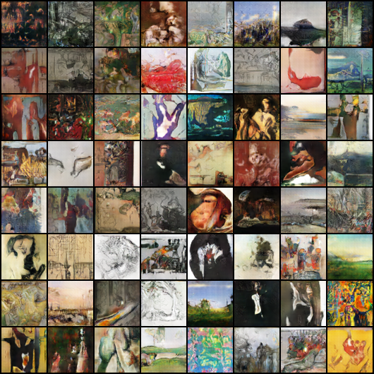

# Boilerplate PyTorch DCGAN

This repository is an extension and embellishment of the sample DCGAN from the [PyTorch repository](https://github.com/pytorch/examples/tree/master/dcgan). It is intended to collect a number of modern tricks for GAN stabilization and be made extensible for anyone wishing to do further research or play around, as well as tested on a tricker dataset (art paintings) to validate stability. 

As the original is from my experience one of the most reliable GAN implementations and has been updated for newer versions of PyTorch, modifications have only been made to update the practices to more modern techniques, but keep the structure and utilities mostly the same. Multi-GPU training and multiple dataset support remain unmodified, and most variable names remain the same except where they have been changed for readability. It is very easy to train on your own set of data: simply create a `data` folder and put your training images into one or more subfolder:

```shell
mkdir data
mv <MY_IMAGE_FOLDER> data
```

You can then pass this folder into the training file, or you can use one of the preprocessed datasets (**note, I have not tested the preprocessed datasets but presume they work. I will update when I have had a chance to train all of them.**).

Wherever possible, clarity has been preferred over cleverness, including redundancies in the different model configurations, to help with understanding and modifications. It should be easy and clear how to add more layers, take layers away, and test out new configurations. 

## Additions

### Spectral Normalization

A recent and popular normalization layer, it has been added to both the generator and discriminator. It's used alongside batch normalization to stabilize training. 

### Truncation Trick

While the model is trained from a non-truncated Normal distribution, when generating images, we sample from a truncated Normal distribution. This has been shown to promote higher quality images while sacrificing diversity.

### Multiple Discriminator Updates

Many different sources have shown that GAN training is more stable when the discriminator is trained more frequently, so here we train the discriminator two times for every generator training (easy to modify).

## Results on WikiArt Dataset

### --lr_g 0.0001 --lr_d 0.0004 --batchSize 64 --imageSize 64 --ndf 64 --ngf 64 --cuda




## Installation

It is strongly advised that you install PyTorch and Torchvision using Anaconda, for the easiest and best GPU support. Follow the instructions [here](https://pytorch.org/get-started/locally). You can also install via the `requirements.txt` file:

```shell
pip3 install -r requirements.txt
```

Installing via pip will require you to install CUDA and cudnn yourself, which is advised against. 

## Running on Your Own Images

The training script expects you to have a data directory with one or more subdirectories filled with images. The way PyTorch's ImageLoader works means that at least one subfolder is necessary, regardless of whether or not your dataset is already segmented into classes. If not, simply put all the images you wish to train into a single subdirectory under your data folder. Then: 

```shell
python3 main.py --dataroot data --dataset folder --workers 8 --batchSize 128 --imageSize 64 --cuda --niter 500 --outf save_data --lr_g 0.0004 --lr_d 0.0001
```

The full list of parameters and their explanations are mostly unchanged and provided in `main.py`. Test your dataset on a smaller image size first before bumping up to 128 or 256 (the other image sizes currently supported).
